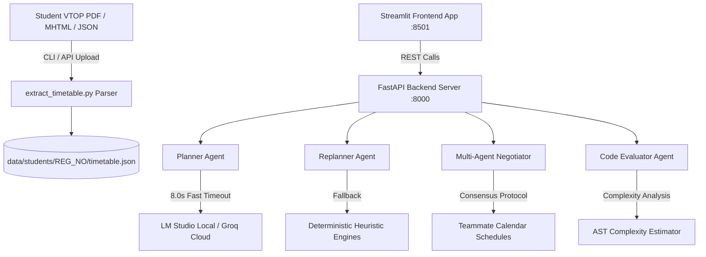

# Project Ichika — Campus Copilot

> **Autonomous On-Device Academic Planner & Multi-Agent Assistant for VIT Chennai Students**  
> Powered by Gemma 4 (12B QAT) / Qwen • 100% Local Privacy • Zero Cloud Dependencies

[](LICENSE)
[](https://www.python.org/)
[](https://fastapi.tiangolo.com/)
[](https://streamlit.io/)
[](https://ai.google.dev/gemma)
[](data/students/)
[](backend/tests/)

---

## 💡 Overview

**Campus Copilot (ICHIKA)** is an intelligent, autonomous academic scheduling assistant engineered specifically for students at **Vellore Institute of Technology (VIT), Chennai**. 

It parses complex student timetables (PDFs and MHTML VTOP web exports), integrates mess menus, campus events, assignment deadlines, and algorithm optimization tools—providing real-time intelligent replanning, multi-agent group study coordination, and comparative code analysis, all running locally on-device.

---

## ✨ Core Autonomous Agents & Modules

### 1. 📅 Academic Planner Agent
- **Inputs**: VTOP timetables, assignment deadlines, mess schedules (`mess_menu.json`), and campus events (`events.json`).
- **Unified Schedule Synthesis**: Automatically structures 4 daily mess meals (Breakfast, Lunch, Snacks, Dinner), VTOP class slots, focus prep sessions before assignment due times, and campus club events into a 5-day weekly agenda.

### 2. ⚡ Autonomous Schedule Replanner Agent
- **High-Visibility Autonomy**: Reporting a missed class (e.g., *"BACSE101 Python Lab"* or *"missed Tuesday"*) visually tags original slots as `[MISSED]` in grey and dynamically re-allocates `REPLANNED` catch-up slots into open evening windows without overlapping core classes or meals.
- **Course & Day Matching**: Handles course codes (`BACSE101`), activity descriptions, and natural day-name misses.

### 3. 🤝 Multi-Agent Study Group Coordinator
- **Multi-Agent Negotiation Protocol**: Autonomous agents representing each teammate (`26BLC1001`, `26BLC1002`, `26BLC1003`, `26BEC1185`, `26BLC1265`) evaluate proposed study windows against their availability and preferences over up to 3 rounds.
- **Visible Negotiation Logs**: Real-time, color-coded transaction logs showing each agent accepting, proposing alternatives, and reaching final coordinator consensus.

### 4. 💻 Comparative Coding & Algorithm Evaluator (Tab 6)
- **Benchmarking Tools**: Compares alternative code implementations for Python, C++, or Java lab submissions.
- **Asymptotic Complexity**: Evaluates Time Complexity ($O(N)$, $O(N^2)$, $O(N \log N)$, $O(\log N)$) and Space Complexity.
- **Efficiency Scoring**: Assigns numeric quality scores out of 100 and provides specific VIT lab submission recommendations.

### 5. 💬 Campus Assistant Chat
- **Persona & Tone Control**: Supports `formal`, `casual`, and `concise` assistant personas.
- **Quick Demo Prompts**: 1-click prompt triggers for drafting formal emails to faculty regarding missed labs, composing WhatsApp study messages, or summarizing daily agendas.

---

## 🌐 Backend REST API Endpoints

| Method | Endpoint | Description | Query / Body Parameters |
| :--- | :--- | :--- | :--- |
| `GET` | `/` | System health check & active model status | None |
| `GET` | `/students` | List registered active student IDs | None |
| `GET` | `/plan` | Generate weekly schedule for student | `student_id` (e.g. `26BEC1185`) |
| `POST` | `/plan` | Generate weekly schedule via JSON body | `{"student_id": "26BEC1185"}` |
| `POST` | `/replan` | Autonomous rescheduling for missed items | `{"student_id": "...", "missed_items": [...]}` |
| `POST` | `/negotiate` | Multi-agent group study coordination | `{"participants": [...], "time_window": "..."}` |
| `POST` | `/compare-code` | Algorithm complexity benchmarking & solution comparison | `{"code_a": "...", "code_b": "...", "language": "python"}` |
| `POST` | `/timetable/extract` | Extract VTOP PDF or MHTML to JSON | Multipart file or `{"student_id": "..."}` |
| `POST` | `/chat` | Interactive assistant query & email drafting | `{"text": "...", "tone": "formal"}` |

---

## 👥 Pre-configured Active Student Profiles (5 People)

| Registration No. | Student Name | Branch | Core Focus |
| :--- | :--- | :--- | :--- |
| **`26BEC1185`** | **Nilesh Kumar** | B.Tech ECE | Network Theory, Python Lab, Multivariable Calculus, Basic Electrical |
| **`26BLC1265`** | **Priya Sharma** | B.Tech CSE | Data Structures & Algorithms, DBMS Lab, Discrete Math |
| **`26BLC1001`** | **Aarav Verma** | B.Tech CSE (AI & ML) | Artificial Intelligence, Machine Learning Lab |
| **`26BLC1002`** | **Ananya Patel** | B.Tech EEE | Signals & Systems, Analog Electronics Lab |
| **`26BLC1003`** | **Rohan Gupta** | B.Tech Mechanical | Engineering Mechanics, CAD/CAM Lab |

---

## 🛠️ Architecture



---

## 🚀 Quick Setup & Run

### Prerequisites
- Python 3.9 or higher
- (Optional) [LM Studio](https://lmstudio.ai/) running locally on `http://localhost:1234/v1` with `google/gemma-4-12b-qat` or `qwen` loaded.

### Installation

1. **Clone the repository:**
   ```bash
   git clone https://github.com/Nilesh-Kumar2412/ICHIKA.git
   cd ICHIKA
   ```

2. **Set up environment variables:**
   ```bash
   cp .env.example .env
   ```

3. **Install dependencies:**
   ```bash
   pip install -r backend/requirements.txt
   pip install -r frontend/requirements.txt
   ```

---

## 🏃 Running the Application

### 1. Start the Backend API Server
```bash
python backend/main.py
```
*API running at `http://localhost:8000` (Swagger docs available at `http://localhost:8000/docs`).*

### 2. Start the Frontend Web UI
```bash
streamlit run frontend/app.py --server.port 8501
```
*UI running at `http://localhost:8501`.*

---

## 🧪 Test Suite Execution

Run the complete 25-test suite covering API endpoints, empirical replanning, multi-agent negotiation caps, and parser isolation:

```bash
python -m pytest backend/tests/ -v
```

---

## 📁 Repository Structure

```text
ICHIKA/
├── backend/
│   ├── main.py               # FastAPI backend server (/plan, /replan, /negotiate, /compare-code, etc.)
│   ├── agents/               # Autonomous agent implementations
│   │   ├── __init__.py       # Package marker
│   │   ├── planner.py        # Weekly agenda generation agent
│   │   ├── replanner.py      # Rescheduling & slot reallocation agent
│   │   └── negotiator.py     # Multi-agent negotiation agent
│   ├── tests/                # Comprehensive Pytest test suite (25 tests)
│   │   ├── __init__.py       # Package marker
│   │   ├── test_api.py
│   │   ├── test_empirical_challenger.py
│   │   └── test_extraction.py
│   └── requirements.txt      # Backend Python dependencies
├── frontend/
│   ├── app.py                # Streamlit high-contrast Cyber-Violet UI
│   ├── .streamlit/           # Custom Streamlit config & theme settings
│   └── requirements.txt      # Frontend dependencies
├── data/
│   ├── shared/               # Shared events, mess menu, & teammate calendars
│   └── students/             # Isolated per-student timetable & deadline profiles
│       ├── 26BEC1185/
│       ├── 26BLC1265/
│       ├── 26BLC1001/
│       ├── 26BLC1002/
│       └── 26BLC1003/
├── extract_timetable.py      # CLI extraction script for PDF & MHTML parsing
├── .env.example              # Environment variables template
├── LICENSE                   # MIT License
└── README.md                 # Technical documentation
```

---

## 📄 License

This project is licensed under the [MIT License](LICENSE).
